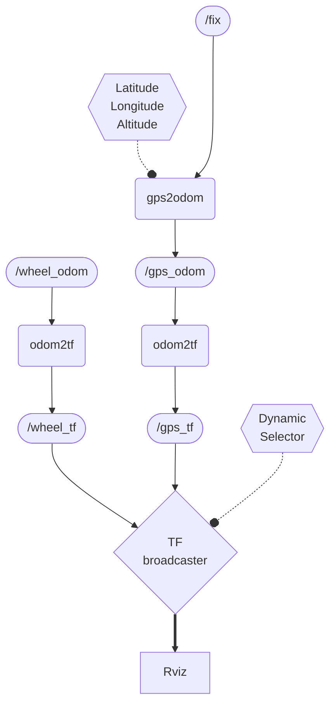

## First Node

It receives the packets from the GPS receiver on the `/fix` topic with a `sensor_msgs/NavSatFix` type.

It then uses this data to convert into a local reference frame fixed on the starting position (or another arbitrary position provided by parameters) to provide odometric data on the `/gps_odom` topic with type `nav_msgs/Odometry` 
### Legend

### Flowchart
