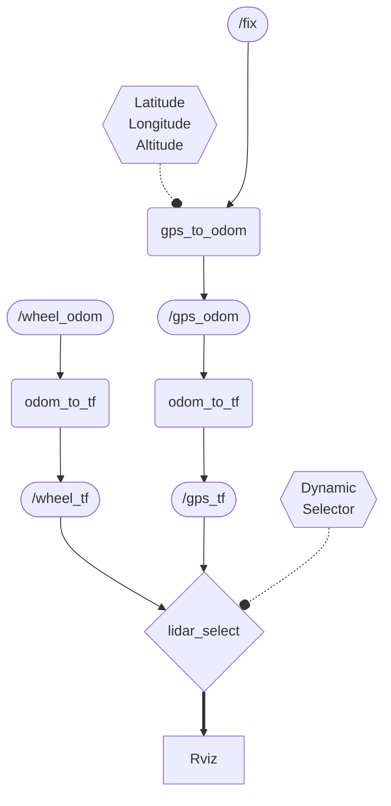
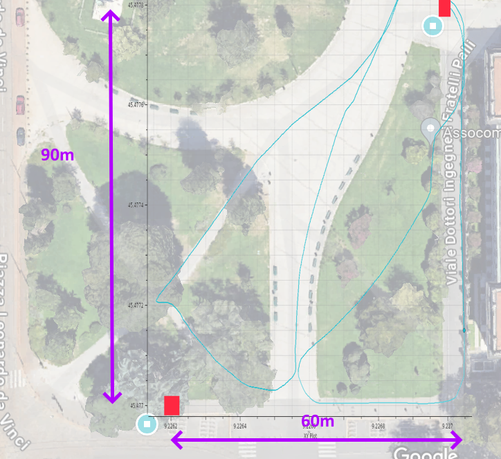

## cmds

```bash
rosbag play -l src/bags/robotics.bag -r 10
rosrun first_project gps_to_odom
rosrun plotjuggler plotjuggler
roslaunch first_project launch.launch


catkin_make && roslaunch first_project launch.launch


LD_PRELOAD=/home/polimi/apitrace-latest-Linux/lib/apitrace/wrappers/glxtrace.so rviz -d  /home/polimi/robotics/src/first_project/lidar.rviz
```

## First Node

It receives the packets from the GPS receiver on the `/fix` topic with a `sensor_msgs/NavSatFix` type.

It then uses this data to convert into a local reference frame fixed on the starting position (or another arbitrary position provided by parameters) to provide odometric data on the `/gps_odom` topic with type `nav_msgs/Odometry` 

### Legend

### Flowchart


In theory the NED should have |N|<90m and |E|<60m

